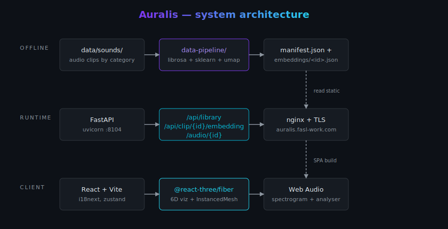
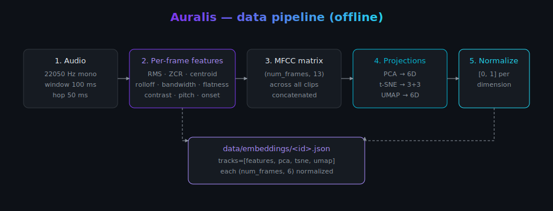
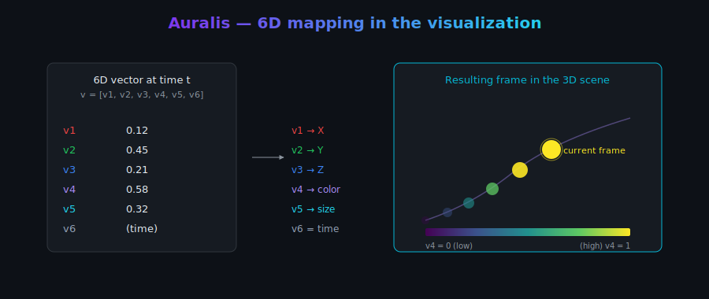

# Auralis — 6D audio visualization

> *Real-time visualization of audio in a six-dimensional embedding space.*

Auralis turns each sound clip into a moving point in a six-dimensional
space and projects it onto a 3D canvas with **color** and **size**
encoding the remaining two dimensions. **Time** is the implicit sixth
axis: past frames stay visible with decreasing opacity, forming a fluid
trail that paints the structure of the sound.

[](docs/architecture.md)

## Quickstart

```powershell
# Windows (Felipe's default)
.\scripts\local.ps1 seed     # generate synthetic seed clips + run pipeline
.\scripts\local.ps1 dev      # backend :8104 + Vite dev :5173
```

```bash
# macOS / Linux / Git Bash
./scripts/local.sh seed
./scripts/local.sh dev
```

Open <http://localhost:5173> in a browser. Pick a clip from the library
on the left, press play, and tweak the controls on the right.

## What is this?

A self-contained web app for **musicians, researchers and the
incurably curious**: drop in a sound, see what happens to it in
embedding space.

* **Six dimensions, your mapping.** The user picks which dimension
  drives X / Y / Z position, which drives color (4D), which drives
  sphere size (5D). Time is the implicit 6th axis (past frames fade
  out into a trail).
* **Nine render modes**, switchable from the control panel:
  * **Spheres** — discrete coloured spheres connected by a polyline.
  * **Smoke** — diffuse coloured clouds with additive blending and outward drift.
  * **Bursts** — each frame is a tiny explosion of coloured rays radiating from its centre.
  * **Constellation** — minimal star-map: tiny pulsing nodes joined by glowing edges.
  * **Aurora** — vertical curtains of light rising from each frame with a gentle sway.
  * **Comet** (default) — a bright glowing head at the cursor + a stretched fading tail.
  * **Tube** — a thick camera-aligned ribbon flowing along the trail.
  * **Galaxy** — permanent twinkling star-clusters at every frame; the whole 6D path stays visible.
  * **Flowfield** — a swarm of glowing particles advecting along the trail's tangent vectors.
* **Export** any frame as a PNG snapshot, or **record** the canvas as a webm video.
* **Five 6D embedding tracks**, all min-max normalized to `[0, 1]`:
  * **Features** — six interpretable spectral scalars.
  * **PCA / t-SNE / UMAP** — corpus-wide projections of MFCC frames.
  * **Tonnetz** — natural 6D harmonic space (Harte et al. 2006), with
    axes encoding fifths, minor thirds and major thirds.
  * **YAMNet** — 1024-D deep AudioSet embeddings (Hershey et al.
    2017) projected to 6D via PCA.
* **Live spectrogram + waveform side panels.** Wired up via the Web
  Audio API and colored with the active colormap.
* **Seven perceptually-uniform colormaps.** viridis, magma, plasma,
  inferno, cividis, turbo, RdBu (diverging).
* **Bilingual UI from day one.** Spanish (default) + English with a
  visible switcher; preference persists across reloads.
* **Light + dark themes**, also persistent.
* **~70 ready-to-play clips** out of the box, organised in a
  collapsible tree by category and subcategory (synthetic, birds,
  mammals, amphibians/reptiles, insects, nature, speeches, music,
  space, mechanical). Each clip ships with verified license metadata
  and per-clip credits.
* **Snapshot export** — one button to grab the current 6D viz as a PNG.

## Diagrams

### Pipeline



### 6D mapping



## Stack

| Layer | Technology |
| --- | --- |
| Backend | Python 3.12 · FastAPI · uvicorn |
| Frontend | TypeScript · React 18 · Vite · @react-three/fiber · zustand · react-i18next |
| Data pipeline | Python · librosa · scikit-learn · umap-learn · numpy · soundfile |
| Storage | Static JSON + audio files committed to the repo |
| Deployment | systemd + nginx + Let's Encrypt (Hetzner VPS) |

## Repository layout

```
CAOS_6D_Sounds/
├── app/                 # FastAPI backend
│   ├── main.py
│   ├── config.py
│   ├── models/          # pydantic schemas
│   ├── routers/         # /api/library, /api/clip, /audio
│   └── services/        # manifest cache
├── frontend/            # Vite/React/R3F SPA
│   ├── src/
│   │   ├── components/  # SoundLibrary, Visualization6D, ControlPanel, ...
│   │   ├── lib/         # api client, colormaps, audio bus
│   │   ├── store/       # zustand store
│   │   └── i18n/        # es.json + en.json
│   └── package.json
├── data-pipeline/       # offline feature + embedding generation
│   ├── extract_features.py
│   ├── compute_embeddings.py
│   ├── synthetic_seeds.py
│   ├── curated_downloads.py
│   ├── build_manifest.py
│   └── ingest.py
├── data/
│   ├── sounds/<category>/<id>.{ogg,oga}
│   ├── embeddings/<id>.json
│   └── manifest.json
├── deploy/              # systemd unit + nginx vhost + setup.sh
├── scripts/             # local.ps1 + local.sh
├── docs/                # theory, refs, history, svg/
├── tests/
├── ATTRIBUTION.md
├── LICENSE
├── README.md
└── requirements.txt
```

## Local development

| Command | What it does |
| --- | --- |
| `scripts\local.ps1 dev` / `scripts/local.sh dev` | Backend on :8104 + Vite dev on :5173 (proxied) |
| `scripts\local.ps1 seed` | Generate synthetic clips + run full pipeline |
| `scripts\local.ps1 ingest` | Re-run pipeline (manifest + embeddings) |
| `scripts\local.ps1 build` | Build the production frontend bundle |
| `scripts\local.ps1 preview` | Build + serve the SPA via FastAPI |
| `scripts\local.ps1 clean` | Remove build outputs |
| `scripts\local.ps1 stop` | Kill local dev processes |

## Adding more clips

```powershell
# Pull the curated library defined in data-pipeline/curated_downloads.py
.\.venv-pipeline\Scripts\python.exe data-pipeline\curated_downloads.py --download

# Or drop your own files into data/sounds/<category>/<id>.<ext>
# (with optional <id>.meta.json sidecar carrying title + license)

# Then regenerate the manifest + embeddings
.\scripts\local.ps1 ingest
```

Each individual audio file must stay below 80 MB (GitHub's per-file
recommendation). The pipeline accepts `.ogg`, `.oga`, `.opus`,
`.mp3`, `.wav`, `.flac`, `.m4a`.

## API

| Path | Purpose |
| --- | --- |
| `GET /health` | Liveness probe |
| `GET /api/library` | Catalog (categories, clips list, embedding methods) |
| `GET /api/clip/{id}` | Single clip metadata |
| `GET /api/clip/{id}/embedding` | Per-frame 6D vectors (4 tracks) |
| `GET /audio/{id}` | Audio asset (range-request friendly) |
| `GET /api/docs` | OpenAPI Swagger UI |
| `GET /` | Built React SPA (and SPA fallback) |

## Documentation

* [Architecture](docs/architecture.md) — components and how they fit
* [Audio embedding theory](docs/audio_embedding_theory.md) — math
  behind the features and projections
* [Development history](docs/development_history.md) — design
  decisions, alternatives considered, roadmap
* [References](docs/references.md) — academic citations
* [User guide](docs/user_guide.md) — UI walkthrough + shortcuts
* [Attribution](ATTRIBUTION.md) — per-clip license breakdown

## Deployment

Production runs on Felipe's Hetzner VPS at
<https://auralis.fasl-work.com> on port 8104. Templates live under
[`deploy/`](deploy/); the operational binding (host + domain + port)
is documented in the private CAOS_MANAGE repo at
`deployments/auralis.md`.

```bash
# On the VPS, as root:
bash /opt/fasl-apps/CAOS_6D_Sounds/deploy/setup.sh   # first-time setup
bash /opt/fasl-apps/CAOS_6D_Sounds/deploy/update.sh  # subsequent redeploys
```

## License

Code: [MIT](LICENSE). Audio assets: see
[ATTRIBUTION.md](ATTRIBUTION.md) — each clip retains its original
license.

---

*Auralis is part of [Felipe Santibañez-Leal](https://github.com/fsantibanezleal)'s
portfolio of small, well-documented science / data-visualization web
apps.*
